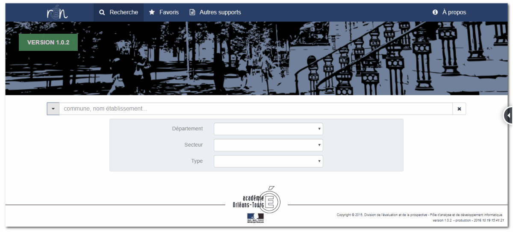
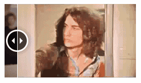
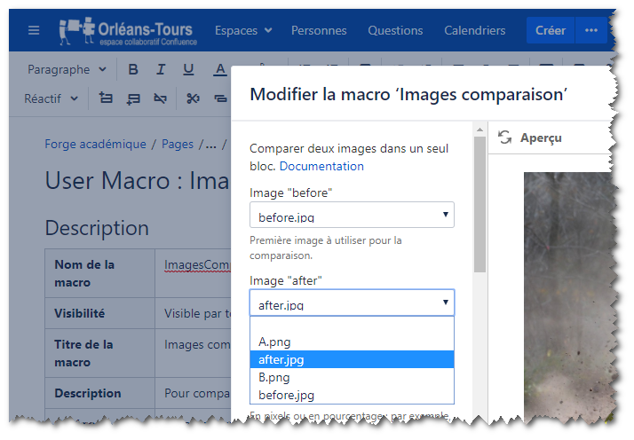
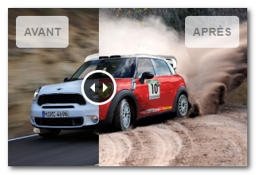
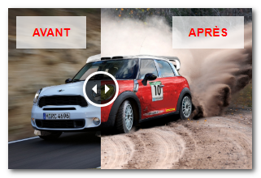
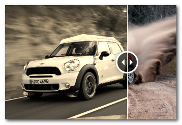
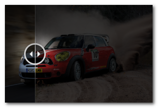
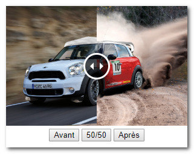

# Confluence user macro : Image Comparison Slider

> A Confluence User Macro to create an image comparison slider.

## Features

This user macro give ability to view a comparison between two images and control it by moving a slider, in order to show differences.

**Compare two image**

You can use it, in order to compare the user interface of two versions of an application.



**Compare gif animation**

You can also make comparison beetwen two gif animation.



**Another Features**

- Images use for comparaison provides from attachments of current page confluence;
- Set height and widht with pixel or percent ;
- Set initial visible ratio. Visible ratio of front element on init, must be a float value between 0 and 1. When ratio is equal to 1, so we see completely front image. And when ratio is equal to 0, so we see completely back image.
- Add or remove a thin vertical blank line as a separator beetwen two images ;
- Add or remove label on before and after image ;
- Add or remove more controls buttons ;
- Apply custom CSS on label ;
- Apply custom CSS on images ;
- Enable click on the circle control in order to toogle images ;
- Set animation easing, animation duration to use.

<br/>


## ImageComparisonSlider parameters

Confluence User macros are useful if you want to create your own custom macros. These can be to perform specific actions, apply custom formatting and much more. You can specify parameters for your macro, so that users can pass it information to determine its behavior on a Confluence page. Confluence user macros can be write with Velocity templating language.

More information about **user macro** and **velocity template language** here :
- https://confluence.atlassian.com/doc/writing-user-macros-4485.html
- https://confluence.atlassian.com/doc/user-macro-template-syntax-223906130.html
- https://velocity.apache.org/engine/1.7/user-guide.html

ImagesCompare uses a lot of different parameters to modify its behavior, define as follows :
```
## @param AttachmentImageBefore:title=Image "before"|type=attachment|required=false|desc=Première image à utiliser pour la comparaison.
## @param AttachmentImageAfter:title=Image "after"|type=attachment|required=false|desc=Seconde image à utiliser pour la comparaison.
## @param width:title=Largeur|type=string|desc=En pixels ou en pourcentage : par exemple, 600 ou 80%. Par défaut utilise 100%.|default=100%
## @param height:title=Hauteur|type=string|desc=En pixels ou en pourcentage : par exemple, 400 ou 50%. Par défaut utilise 100%.|default=100%
## @param AddSeparator:title=Ajoute un séparateur|type=boolean|default=true
## @param InitVisibleRatio:title=Ratio initial de visibilité|type=string|required=false|desc=Nombre réel entre 0 et 1 pour définir le ratio initial de visibilité entre les images (par défaut à 0.5)|default=0.5
## @param LabelBefore:title=Texte à gauche|type=string|desc=Ajoute un texte à gauche sur l image "before".
## @param LabelAfter:title=Texte à droite|type=string|desc=Ajoute un texte à droite sur l image "after".
## @param LabelBeforeCustomCSS:title=CSS texte à gauche|type=string|desc=Applique un style CSS sur le texte à gauche - exemple: "padding": "10px 20px","color": "red"
## @param LabelAfterCustomCSS:title=CSS texte à droite|type=string|desc=Applique un style CSS sur le texte à droite - exemple: "right": "40px","top": "80px"
## @param ImageBeforeCustomCSS:title=CSS image à gauche|type=string|desc=Applique un style CSS sur l image de gauche 'before' - exemple: "filter":"sepia(80%)"
## @param ImageAfterCustomCSS:title=CSS image à droite|type=string|desc=Applique un style CSS sur l image de droite 'after' - exemple: "filter":"grayscale(50%)"
## @param AddClickOnDragCircle:title=Activer le bouton de déplacement|type=boolean|default=true
## @param AddButtons:title=Ajout de bouttons|type=boolean|default=false
## @param DispositionButtons:title=Disposition des bouttons|type=enum|enumValues=left,center,right|default=center
## @param AnimationEasing:title=Animation type|type=enum|enumValues=linear,swing|default=swing
## @param AnimationDuration:title=Animation durée|type=string|default=400
```


<br/>

More details on parameters of ImageCompare :

Parameter | Description
----------|------------
`AttachmentImageBefore` and `AttachmentImageAfter` | Theses images must be save in the current page as an attachment file. Image *before* is placed on front, and *after* on back. <br/><br/> 
`Height` and `Width` | Set with pixel ('500px') or with percent (80%).
`AddSeparator` | Show a thin vertical blank line beetween two images. <br/><br/> 
`InitVisibleRatio` | Visible ratio of front element on init, must be a float value between 0 and 1. When ratio is equal to 1, so we see completely front image. And when ratio is equal to 0, so we see completely back image. <br/><br/> 
`LabelBefore` and `LabelAfter` | Add label on *before* and/or *after* image. <br/><br/> 
`LabelBeforeCustomCSS` and `LabelAfterCustomCSS` | Apply custom CSS on label *before* and/or *after* image. Code CSS must respect the syntax of the jQuery method `.css()` - exemple : `"padding": "10px 20px","color": "red","border-radius":"0px"`. <br/><br/> 
`ImageBeforeCustomCSS` and `ImageAfterCustomCSS` | Apply custom css on *before* and/or *after* image. Code CSS must respect the syntax of the jQuery method .css() - exemple : `"filter":"sepia(80%)"` <br/><br/> 
`AddClickOnDragCircle` | Enable click on the circle in order to toogle images. <br/><br/> 
`AddButtons` | Add buttons to show : before, 50/50 and after view.  <br/><br/> 
`DispositionButtons` | Set disposition's buttons : `left`, `center` or `right`.
`AnimationEasing` | Set animation easing to use : `linear` or `swing`.
`AnimationDuration` | Set animation duration in ms.


<br/>

## Credits

ConfluenceUserMacro-ImageComparisonSlider depends on 

- `jQuery`. It use the jQuery version embebded in Confluence. To determine the current version of jQuery in Confluence, you can type in console chrome Webtools `console.log(AJS.$().jquery);`. Test with Atlassian Confluence 6.13.2; we have jQuery 1.7.2. 
- `Hammer.js` v2.0.8 - https://hammerjs.github.io/
- `jQuery-images-compare` - https://github.com/sylvaincombes/jquery-images-compare.
- Few images from Cocoen project.


<br/>

## Licence

Copyright (c) 2019. 6i by 2o1oo <vb20100bv@gmail.com>

Release under [MIT](./LICENSE.md) license.